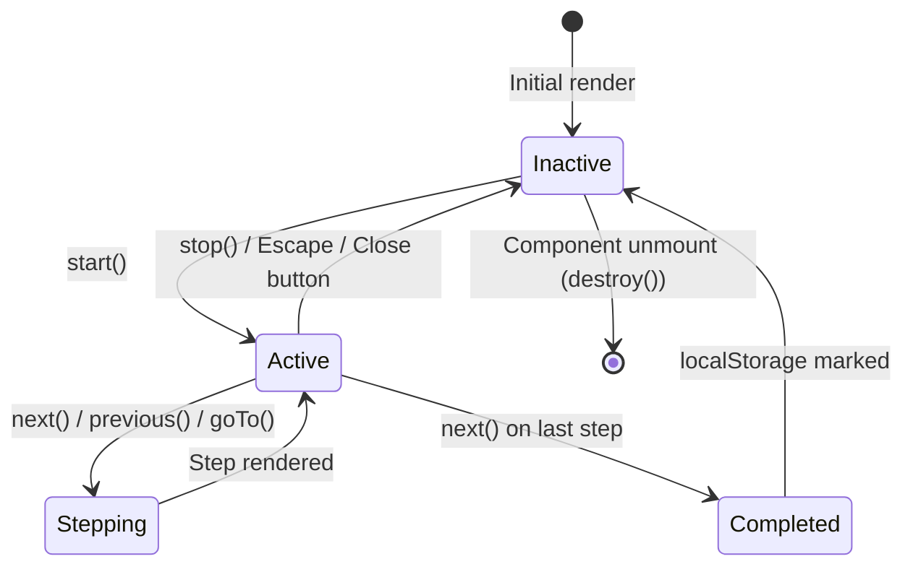

# System Architecture & Technical Specifications

> **Deep dive into the architecture of [`webdrive`](https://www.npmjs.com/package/webdrive) integration within Next.js App Router, React Server Components, and client state machines.**

---

## 1. Architecture Overview

`webdrive` is designed around a decoupled, framework-agnostic core that interacts exclusively with native browser DOM APIs. 

In a modern Next.js App Router application, components are Server Components by default. To consume DOM-dependent libraries like `webdrive`, we isolate the tour layer into a dedicated **Client Boundary** (`"use client"`), while keeping the page layout and data rendering in efficient Server Components.

```
┌─────────────────────────────────────────────────────────────┐
│ Next.js Server Component Tree (app/page.tsx)                │
│                                                             │
│  ┌─────────────────────────┐  ┌──────────────────────────┐  │
│  │ <Header />              │  │ <MetricsGrid />          │  │
│  │ id="#dashboard-header"  │  │ id="#metrics-card"       │  │
│  └─────────────────────────┘  └──────────────────────────┘  │
│                                                             │
│  ┌─────────────────────────┐  ┌──────────────────────────┐  │
│  │ <Sidebar />             │  │ <RecentActivity />       │  │
│  │ id="#sidebar-nav"       │  │ id="#activity-feed"      │  │
│  └─────────────────────────┘  └──────────────────────────┘  │
│                                                             │
│  ────────────────── Client Boundary ──────────────────────  │
│                                                             │
│  ┌───────────────────────────────────────────────────────┐  │
│  │ <OnboardingTour /> ("use client")                     │  │
│  │  - useWebDrive hook                                   │  │
│  │  - WebDrive instance lifecycle                        │  │
│  │  - Mounts SVG cutout mask + Popover into DOM root     │  │
│  └───────────────────────────────────────────────────────┘  │
└─────────────────────────────────────────────────────────────┘
```

---

## 2. Server Component vs Client Boundary Strategy

### Why WebDrive is 100% SSR-Safe:
1. **Module Evaluation Safety**: `webdrive` never references `window`, `document`, or `localStorage` during initial script evaluation. Importing `import { WebDrive } from "webdrive"` in Node.js or SSR builds will never throw `ReferenceError: window is not defined`.
2. **Runtime Guard**: All DOM manipulations (`document.createElement`, `addEventListener`, `MutationObserver`) occur inside the `TourController`, which is only instantiated inside browser environments.
3. **Hydration Protection**: The tour DOM layer is created lazily when `tour.start()` is invoked. It is appended to `document.body` outside React's virtual DOM tree, preventing React reconciliation conflicts and hydration mismatch warnings.

---

## 3. Custom React Hook: `useWebDrive`

To expose an idiomatic, reactive API to React components, we provide the `useWebDrive` hook located at `src/hooks/useWebDrive.ts`.

### Hook Contract:

```typescript
export interface UseWebDriveReturn {
  tour: WebDrive | null;
  isActive: boolean;
  currentStepIndex: number;
  start: (startIndex?: number) => Promise<void>;
  stop: () => Promise<void>;
  next: () => Promise<void>;
  previous: () => Promise<void>;
  goTo: (index: number) => Promise<void>;
  reset: () => Promise<void>;
}
```

### State Machine Diagram:



### Lifecycle Guarantees:
- **Automatic Teardown**: Upon React component unmount, `tourRef.current?.destroy()` is invoked in `useEffect` cleanup to purge all event listeners, SVG nodes, observers, and timers.
- **Stable References**: Navigation methods (`start`, `stop`, `next`, `previous`) are memoized using `useCallback` to prevent unnecessary component re-renders.

---

## 4. Handling Dynamic Elements with `missingElementBehavior`

In modern applications, elements often render asynchronously after API calls, suspense boundaries, or tab changes.

`webdrive` provides built-in resilience:

```typescript
const tour = new WebDrive({
  missingElementBehavior: "wait", // "wait" | "skip" | "stop"
  missingElementWaitTimeout: 4000,
  steps: [
    {
      element: "#dynamic-analytics-table",
      title: "Real-Time Data",
      description: "This table appeared after fetching data from the API."
    }
  ]
});
```

### How `"wait"` works under the hood:
1. `resolveElement(target)` checks if the element is currently connected to the DOM.
2. If missing, a `MutationObserver` attaches to `document.body` watching `childList` and `subtree` changes.
3. As soon as the element is mounted, the observer immediately disconnects, clears timeout counters, and highlights the target without lag.
4. If the element does not mount within `missingElementWaitTimeout`, it logs a development warning and advances to the next step gracefully.

---

## 5. Performance & Memory Management

1. **RequestAnimationFrame Throttling**: Positioning recalculations on window resize and scroll events are debounced using `requestAnimationFrame`.
2. **Passive Listeners**: Scroll listeners are registered with `{ passive: true }` to guarantee 60fps scrolling without blocking the main browser thread.
3. **Zero Leaks**: All listeners (`resize`, `scroll`, `keydown`, `click`) and observers (`MutationObserver`) are tracked and completely dereferenced in `tour.destroy()`.
