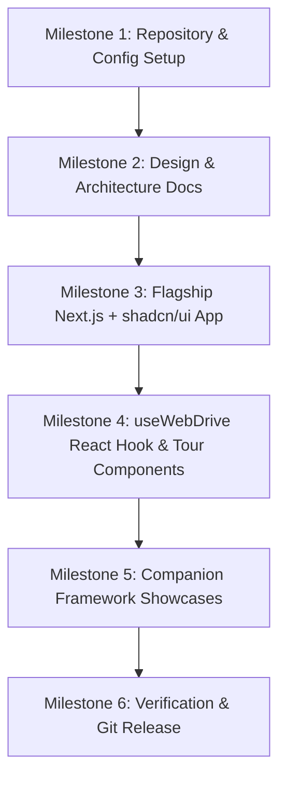

# Master Implementation Plan: WebDrive Examples Showcase

> **A production-ready reference architecture and showcase repository demonstrating the implementation of [`webdrive`](https://www.npmjs.com/package/webdrive) across modern web frameworks and UI design systems.**

---

## 1. Executive Summary & Project Mission

The mission of `webdrive-examples` is to serve as the definitive, real-world implementation guide for **`webdrive`** (the framework-agnostic TypeScript UI tour and onboarding walkthrough library). 

While the core `webdrive` library operates with zero runtime dependencies and manipulates the standard browser DOM directly, real-world applications use diverse frontend architectures such as **Next.js (App Router, Server Components, SSR)**, **React 18+**, **Vue 3**, and modern styling frameworks like **Tailwind CSS** and **shadcn/ui**.

This repository bridges that gap by providing:
1. A **flagship Next.js LTS App Router** SaaS Analytics Dashboard integrating `webdrive` with `src/` directory layout and `shadcn/ui`.
2. A clean, reusable custom React hook: `useWebDrive`.
3. Companion implementation showcases for **Vanilla JS/TS**, **React Vite**, and **Vue 3**.
4. Exhaustive architectural and design documentation (`Design.md`, `Architecture.md`, `Plan.md`).

---

## 2. Core Objectives

| Objective | Description | Target Metric |
| :--- | :--- | :--- |
| **Real NPM Dependency** | Consumes [`webdrive`](https://www.npmjs.com/package/webdrive) directly from NPM. | Zero local path hacks (`npm install webdrive`). |
| **Next.js LTS & App Router** | Showcase client component encapsulation with `"use client"`. | 100% SSR-safe, zero hydration mismatches. |
| **shadcn/ui Design Harmony** | Map `webdrive` CSS custom properties to shadcn/ui HSL color tokens. | Seamless light & dark mode theme inheritance. |
| **Developer Experience** | Provide copy-paste hooks and patterns for engineering teams. | Reusable `useWebDrive.ts` hook ready for production. |
| **Multi-Framework Coverage** | Provide working examples for Vanilla JS, React Vite, and Vue 3. | Clean, self-contained demonstration folders. |

---

## 3. Technology Stack & Framework Matrix

| Layer | Technology | Version | Role |
| :--- | :--- | :--- | :--- |
| **Core Tour Library** | [`webdrive`](https://www.npmjs.com/package/webdrive) | `^1.1.0` | UI tour, SVG cutout overlay, popovers, positioning. |
| **Framework (Flagship)**| Next.js (LTS) | `^14.2.10` | App Router, React Server Components, client boundaries. |
| **UI Library** | React | `^18.3.1` | Component model, hooks, client hydration. |
| **Design System** | shadcn/ui + Radix UI | Latest | Accessible UI components (Cards, Buttons, Badges, Avatars). |
| **CSS Framework** | Tailwind CSS | `^3.4.10` | Utility-first styling with CSS variables. |
| **Icons** | Lucide React | `^0.439.0` | Iconography for dashboard and tour controls. |
| **Language** | TypeScript | `^5.5.4` | Strict type safety across all components and steps. |

---

## 4. Use-Case Coverage Checklist

- [x] **Product Onboarding Tour**: Welcome sequence guiding new users through Navigation, Metrics, and Profile.
- [x] **Non-Destructive Target Highlighting**: Highlighting elements in complex layouts without breaking z-index or stacking contexts.
- [x] **Responsive Boundary Collision Handling**: Automatic popover repositioning and coordinate clamping.
- [x] **Dark Mode Theme Switching**: Instant color token recalculation for both dashboard and tour popover.
- [x] **Dynamic / Asynchronous Elements**: Handling elements rendered dynamically with `missingElementBehavior: "wait"`.
- [x] **Keyboard Navigation & Accessibility**: `ArrowRight`, `ArrowLeft`, `Escape`, focus trapping, and ARIA dialog semantics.
- [x] **State Persistence & Replay**: Remembering completed tours via `localStorage` with explicit Reset functionality.

---

## 5. Implementation Roadmap & Milestones

### Milestone 1: Workspace & Tooling Initialization
- Initialize directory structure at `/Users/prashantlugun/Documents/GitHub/webdrive-examples`.
- Configure `package.json` with dependencies (`webdrive`, `next`, `react`, `react-dom`, `tailwindcss`, `lucide-react`).
- Configure `tsconfig.json`, `next.config.mjs`, `tailwind.config.ts`, `postcss.config.mjs`, `components.json`.

### Milestone 2: Master Architectural Documentation
- Write `Design.md`: Design tokens, shadcn/ui color mapping, typography, mobile layout, accessibility.
- Write `Architecture.md`: Next.js Server vs Client boundary, `useWebDrive` hook state machine, SSR safety, memory management.

### Milestone 3: Flagship Next.js LTS Application (`src/`)
- Build `src/app/layout.tsx`, `src/app/page.tsx`, and `src/app/globals.css`.
- Build shadcn/ui primitives (`src/components/ui/button.tsx`, `card.tsx`, `badge.tsx`, `avatar.tsx`).
- Build SaaS dashboard views (`Header.tsx`, `Sidebar.tsx`, `MetricsGrid.tsx`, `RecentActivity.tsx`).

### Milestone 4: Tour Integration Layer
- Implement `src/hooks/useWebDrive.ts` for clean React state management.
- Define strongly typed tour steps in `src/lib/tour-steps.ts`.
- Implement client-side `src/components/tour/OnboardingTour.tsx`.

### Milestone 5: Companion Framework Examples
- Implement `examples/01-vanilla-saas/` (pure HTML/CSS/JS).
- Implement `examples/02-react-vite/` (standalone React 18+ Vite project).
- Implement `examples/03-vue-composition/` (Vue 3 Composition API project).

### Milestone 6: Verification & Git Publishing
- Run `npm run build` and `npm run typecheck` to verify zero compile or hydration errors.
- Initialize Git repository, commit all files, and link remote origin `https://github.com/Abhi-6284/webdrive-examples.git`.

---

## 6. Verification & Quality Assurance Strategy

1. **Compilation & Build**: `npm run build` must complete with zero errors and generate static/dynamic route artifacts cleanly.
2. **Strict TypeScript**: `tsc --noEmit` must pass with 0 errors under `"strict": true`.
3. **SSR Safety Verification**: Next.js server evaluation must execute without accessing `window`, `document`, or `localStorage`.
4. **Visual & Interaction Verification**: Popovers must position correctly, responsive resizing must update overlay bounds smoothly, and dark mode toggle must adapt colors seamlessly.
